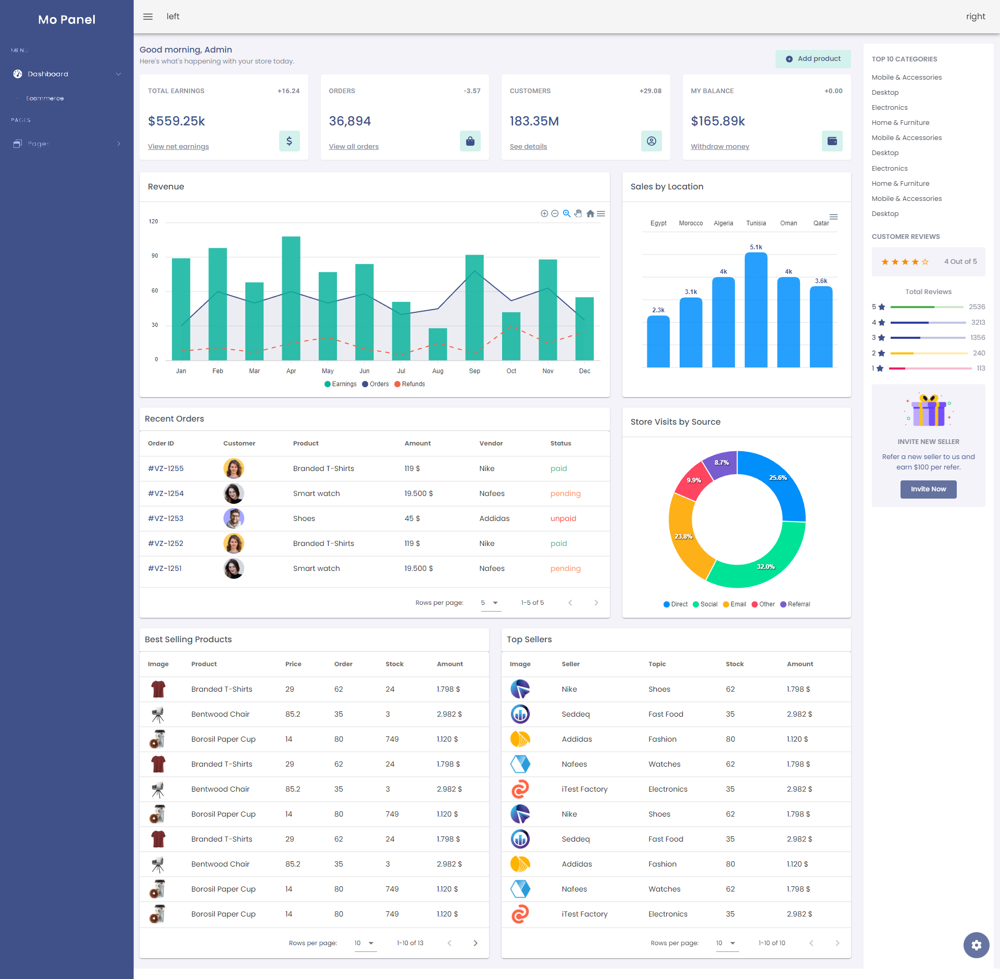

# Mo Panel

### Screenshot


## Description
```
Mo Panel is an admin dashboard template built with Bootstrap v5.1.3, Vue 3. You can build any type of web application like eCommerce, CRM, CMS, project management apps, admin panels etc using Mo Panel.
```

### What is Mo Panel?
```
Mo Panel is an admin dashboard template.
```

### Why should I use Mo Panel?
```
Practical training on admin control panel.
```

## Project setup
```
npm install
```

### Compiles and hot-reloads for development
```
npm run serve
```

### Compiles and minifies for production
```
npm run build
```

### Run your unit tests
```
npm run test:unit
```

### Lints and fixes files
```
npm run lint
```

### Customize configuration
See [Configuration Reference](https://cli.vuejs.org/config/).
